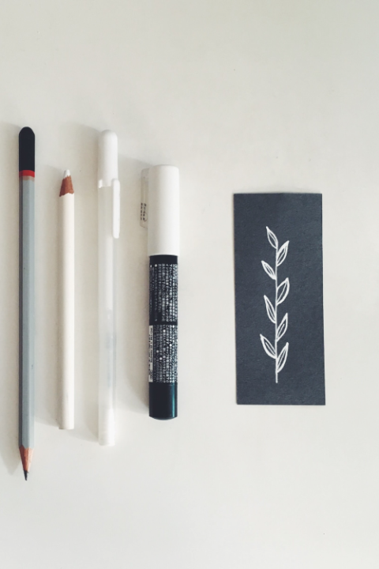

# The Process of This Website

The process of web page programming follows a clear path. First, I create a basic HTML layout, then I add Bootstrap code, and finally, I incorporate necessary CSS code. The most challenging part is the design phase, which took around a month. The actual webpage programming was completed in a week. The main programming difficulty arose from my unfamiliarity with certain codes, like Bootstrap. Unfortunately I had forgotten almost 90% of the code I had previously learned. This led me to relearn and experiment many times during programming. 

The two most crucial lessons from this experience were learning to break down my designs and continuously learning from online resources. Initially, I found writing HTML simple, but when I began using Bootstrap, I realized the need to deconstruct my design into grids, much like disassembling Lego. This concept also highlighted the importance of carefully planning grid layouts during the design phase, keeping the subsequent programming in mind.

The second lesson is about continuous learning. I spent nearly 80% of my time searching for resources and seeking help from my professors and classmates. Unexpected small issues would sometimes halt my progress for an entire day. Yet, I persevered until I found solutions. As long as I hadn't achieved my desired outcome, I remained in a state of constant learning. I still haven't complete my exlpore page and my parallax till this moment, but I'll try to finish my design after this assignment.

Although this week felt challenging, it was rewarding. I never imagined that I could create a web page based on my own design. This feeling is truly amazing! 

I want to sincerely thank Rob for providing me with the support and patient guidance I needed. Without him, I wouldn't have been able to finish such a challenging project.

# credit for stock images:
-  from [unsplash](https://unsplash.com/photos/viE17T0wtac)
-  from from [unsplash](https://unsplash.com/photos/_T4w3JDm6ug) 
-  from from [unsplash](https://unsplash.com/photos/N_G2Sqdy9QY) 

# CSS Libraries
- Fonts: "Raleway" from [googlefonts](https://fonts.google.com/)
- CSS and JavaScript plugin from [Bootstrap](https://getbootstrap.com/)